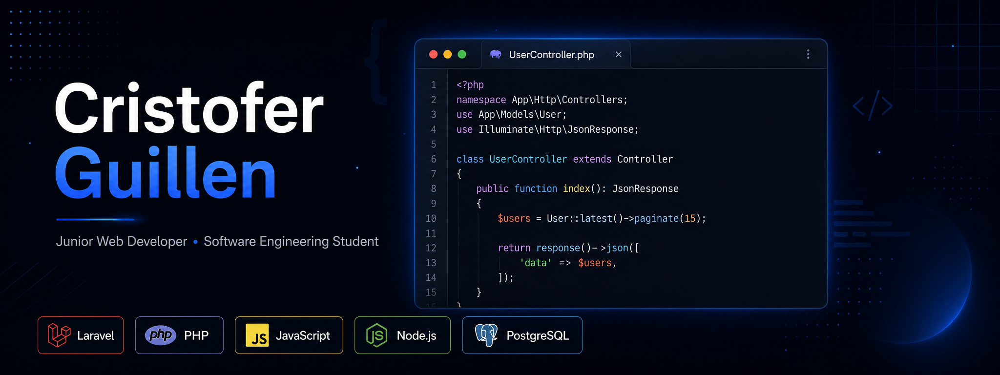

 

---

## 👨‍💻 About Me

<strong>
Junior Web Developer and Software Engineering student from Cali, Colombia, focused on building web applications, backend systems, REST APIs, and database-driven solutions.
</strong>

  

I have practical experience developing academic and personal web projects using Laravel, PHP, JavaScript, Node.js, Express.js, MySQL and PostgreSQL. I also have experience supporting internal applications, documenting requirements, performing functional validations, reporting issues, and improving system workflows.

I am currently looking to keep growing as a Junior Web Developer, with a focus on backend development, web applications, REST APIs, and database-driven systems.

<ul>
  <li>🎓 <b>Currently studying:</b> Software Engineering</li>
  <li>💻 <b>Main stack:</b> Laravel, PHP, JavaScript, PostgreSQL, Node.js and Express.js</li>
  <li>🧩 <b>Focused on:</b> Web applications, backend development, REST APIs and database-driven systems</li>
  <li>🧪 <b>Additional experience:</b> Functional testing, application support, SRS documentation and user manuals</li>
  <li>📊 <b>Interested in:</b> Backend development, QA, data organization and business applications</li>
  <li>🌱 <b>Currently learning:</b> Backend architecture, REST APIs, PostgreSQL and data analysis with Python</li>
  <li>📫 <b>Reach me at:</b> <a href="mailto:guillencristofer911@gmail.com">guillencristofer911@gmail.com</a></li>
</ul>

---

## 🛠️ Technologies & Tools

### 👨‍💻 Programming Languages

  
  
  
  

### 🧰 Frameworks and Libraries

  
  
  
  
  
  
  
  
  
  

### 🗄️ Databases

  
  

### 💻 Software and Tools

  
  
  
  
  
  
  
  

---

## 📝 Recent Projects

Here are some of the projects I have built while practicing backend development, web applications, database design, authentication, role-based access control, and system documentation.

### MEDICONNECT - Medical Appointment Management System

Web platform for managing medical appointments, user administration and doctor availability.

**Tech Stack:** Laravel 12, PHP 8.2, MySQL, Blade, Tailwind CSS

- Implemented role-based access control for patients, doctors and administrators.
- Developed appointment request, confirmation, rejection and schedule availability features.
- Added validations for future dates, available schedules and duplicate appointment prevention.
- Applied Laravel MVC structure using controllers, seeders, middleware and database relationships.

---

### BIBLIOTECH - Library Management System

Web application for managing books, users, loans, returns and library records.

**Tech Stack:** Laravel 12, PHP 8.2, Livewire 3, MySQL, Tailwind CSS, Alpine.js

- Developed book loan and return management with automatic date calculation.
- Implemented user, book and role administration.
- Integrated reactive components with Livewire to improve user interaction.
- Created technical documentation and system diagrams for better maintainability.

---

### SIP - Academic Interactive Portal

Academic web portal focused on publications, projects, comments, favorites, content reports and user administration.

**Tech Stack:** Node.js, Express.js, JavaScript, MySQL, JWT, bcrypt, Multer

- Built a REST API with JWT authentication and role-based access control.
- Implemented user management for administrators, students and graduates.
- Added multimedia and document upload features using Multer.
- Developed administrative features for content management, report tracking and moderation.

---

### HOSTIFY - Hotel Management System

SaaS project in development focused on reservations, rooms, operational states, check-in/check-out and small hotel administration.

**Tech Stack:** Laravel, PHP, Filament, PostgreSQL, Tailwind CSS

- Designed reservation and availability management modules.
- Used Filament to build administrative panels for operational management.
- Structured room, reservation and resource status information.
- Focused on information management, process organization and operational traceability.

---

## 🎓 Education & Certifications

### Education

- Software Engineering - In progress  
  Corporación Universitaria Iberoamericana

- Software Programming Technician  
  SENA

### Certifications & Courses

- Excel Intermedio - SENA
- Análisis Exploratorio de Datos con Python - SENA
- Python Essentials 1 - Cisco
- JavaScript Essentials 1 - Cisco
- Introduction to Cybersecurity - Cisco
- Ethical Hacker - Cisco

---

## 📊 GitHub Stats

 

  

<table border="0" align="center">
<tr border="0">
<td width="50%" align="center">
  
  

</td>

<td width="50%" align="center">

  
  
</td>
</tr>
</table>

 

  <b>Note:</b> Most used languages are based on my public repositories and do not necessarily reflect my full experience or skill level.

  

---

## 🤝 Connect with Me

  
  
  

---

⭐️ Thanks for visiting my profile!

